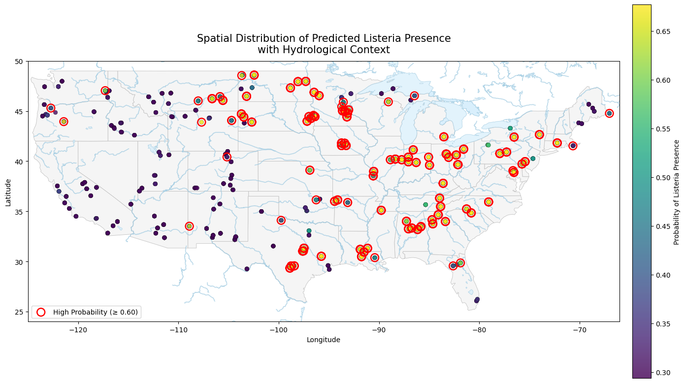

# Listeria in Soil — IAFP AI Benchmarking Student Competition 🏆🦠

🥬 This repository contains an end-to-end, reproducible **machine learning pipeline** developed for the **IAFP AI Benchmarking Student Competition on Predictive Food Safety Models**. The project addresses the challenge theme:

> **Predicting pathogen presence in food production environments**

Using a nationwide GIS-based dataset of U.S. soil samples, this work focuses on predicting the **presence or absence of *Listeria spp.* in soil** based on environmental, soil, climate, land-use, and geographic variables. The goal is to demonstrate how **AI/ML tools can support proactive food safety surveillance and risk mitigation** in agricultural and food production systems.

This repository is designed to meet competition requirements for:
- Model performance benchmarking  
- Interpretability and actionable insights  
- Code quality and reproducibility  

---

## Data Source and Citation

The dataset used in this competition submission is derived from the following peer-reviewed publication:

> **Liao, J., Guo, X., Weller, D. L., et al. (2021).**  
> *Nationwide genomic atlas of soil-dwelling Listeria reveals effects of selection and population ecology on pangenome evolution.*  
> **Nature Microbiology, 6, 1021–1030.**  
> https://doi.org/10.1038/s41564-021-00935-7

📌 **Please cite this paper when using the dataset or reporting results derived from this repository.**

---

## Sample Analysis

### Competition Context

This project is developed as part of the **IAFP AI Benchmarking Student Competition**, which challenges participants to build and document predictive ML/DL models for real-world food safety problems using curated academic and industry datasets.

The specific focus of this submission is:
- **GIS-based pathogen presence prediction**
- **Environmental monitoring for food safety risk assessment**

---

## Prediction Task

### Task Type
- **Binary classification**

### Objective
- Predict the **presence or absence of *Listeria spp.* in U.S. soil samples**

### Outcome Variable
- A binary presence/absence label derived from the number of *Listeria* isolates obtained per soil sample.

### Predictor Variables
- Soil physicochemical properties  
- Climate and moisture indicators  
- Land-use characteristics (e.g., cropland, shrubland)  
- Geographic information (latitude and longitude)

A detailed description of all predictor and outcome variables is provided in:
- **`ListeriaSoil_Metadata.csv`**

📊 The cleaned and analysis-ready dataset used in this competition submission is:
- **`ListeriaSoil_clean.csv`**

---

## valuation Metrics

In accordance with the competition evaluation criteria, classification models developed using this pipeline are evaluated using:

- **ROC AUC**
- **Sensitivity (Recall)**
- **Specificity**
- **F1 Score**

Metric implementations are documented within the model training scripts (e.g., `Customize_script.py`) to ensure transparency and reproducibility.

---

## Repository Structure

```text
IAFP_2026_Competition/
├── data/
│   ├── raw/            # Original datasets
│   └── processed/      # Analysis- and model-ready datasets
├── scripts/
│   ├── 01_univariate_screening.py
│   ├── 02_ML_Prediction.ipynb
│   ├── 03_Agresti–Coull.R
│   ├── 04_Listeria_soil_imbalanced.py
│   ├── 05_logistic_regression_odds.R
├── src/
│   ├── config.py       # Centralized path management
│   └── __init__.py
├── outputs/            # Figures and exported results
├── requirements.txt
└── README.md
```
---

### ⚙️ Installation
Dependencies

This project is implemented in Python and relies on the following core libraries:
- NumPy
- Pandas
- Scikit-learn
- SciPy
- Statsmodels
- Matplotlib
- Seaborn
- TensorFlow / Keras (for downstream deep learning models)

All required dependencies are listed in requirements.txt.

---

###  Getting Started
1️⃣ Clone the repository
```bash
git clone https://github.com/<your-username>/IAFP_2026_Competition.git
cd IAFP_2026_Competition
```
2️⃣ Install dependencies
```bash
pip install -r requirements.txt
```
3️⃣ Run univariate screening (baseline analysis)
```bash
python -m scripts.01_univariate_screening --input ListeriaSoil_clean.csv
```
---

#### Optional flags:

- save-results : save outputs to data/processed/
- save-plots : export figures to outputs/
- show-plots : display figures interactively

---

#### Reproducibility and Code Quality

Reproducibility is a core judging criterion for the competition. This repository ensures reproducible research by:

- Using repository-relative paths (no local or cloud-specific paths)
- Providing a fully script-based pipeline (no hidden notebook state)
- Recording metadata for each analysis run
- Using deterministic random seeds where applicable
- Maintaining modular, well-documented code

---

#### Competition Information

This work is submitted to the IAFP AI Benchmarking Student Competition on Predictive Food Safety Models, supported by Cornell University, Agroknow, and academic–industry collaborators.

📄 Written report deadline: March 1, 2026
📍 Finalists presentation: IAFP 2026 Annual Meeting (New Orleans, LA)

---
## Table of Contents

- [Installation](#️-installation)
- [Getting Started](#getting-started)
- [Exploratory Analysis and Preprocessing Results](#exploratory-analysis-and-preprocessing-results)
  - [Label Distribution](#label-distribution)
  - [Correlation Structure of Predictors](#correlation-structure-of-predictors)
  - [Univariate Effect Size Analysis](#univariate-effect-size-analysis-cliffs-delta)
  - [Land-use Composition](#land-use-composition-by-listeria-presence)
  - [Biological Interpretation](#biological-interpretation)
- [From Presence–Absence to Risk Metrics](#from-presenceabsence-prediction-to-quantitative-risk-metrics-translating-soil-surveillance-data-into-food-safetyrelevant-estimates)


---
## Exploratory Analysis and Preprocessing Results

### Label Distribution

The final cleaned dataset includes **622 soil samples**, with the outcome variable defined as the binary presence or absence of *Listeria spp.* based on culture results.

```text
Listeria present:  311 samples (50%)
Listeria absent:   311 samples (50%)
```

### Correlation Structure of Predictors

A Pearson correlation matrix was computed across soil chemistry, climate, land-use, and geographic variables to examine linear dependencies and potential multicollinearity among predictors.

**Key observations:**
- Soil nutrients (e.g., total nitrogen, organic matter, and trace metals) form correlated clusters  
- Climate variables exhibit strong regional structure  
- Land-use variables show expected compositional relationships  
- No single predictor displays extreme correlation with the outcome label  

These patterns indicate structured but non-redundant predictors, supporting their retention in downstream tree-based models.

---

### Univariate Effect Size Analysis (Cliff’s Delta)

To quantify the magnitude and direction of associations between individual predictors and *Listeria* presence, **Cliff’s Delta** was used as a nonparametric effect size measure. This approach emphasizes practical relevance beyond statistical significance alone.

#### Top Variables by Absolute Cliff’s Delta

| Variable | Median (Absent) | Median (Present) | Δ (Present − Absent) | Cliff’s Δ | Adjusted p-value |
|---------|-----------------|------------------|----------------------|-----------|------------------|
| Shrubland (%) | 3.6009 | 0.3208 | −3.2801 | −0.44 | 5.9e−20 |
| Moisture | 0.1723 | 0.2887 | +0.1164 | +0.42 | 4.5e−18 |
| Cropland (%) | 1.1679 | 6.0231 | +4.8552 | +0.39 | 5.2e−16 |
| Longitude | −102.45 | −90.58 | +11.87 | +0.38 | 1.5e−15 |
| Pasture (%) | 0.3966 | 4.9012 | +4.5046 | +0.31 | 7.4e−11 |

All reported associations remained statistically significant after false discovery rate (FDR) correction.

---

### Land-use Composition by *Listeria* Presence

Comparisons of mean land-use composition revealed systematic differences between *Listeria*-positive and *Listeria*-negative soil samples.

**Observed patterns:**
- *Listeria*-absent soils are dominated by **shrubland and grassland**
- *Listeria*-present soils show higher proportions of **cropland and pasture**
- Shrubland coverage is markedly reduced in positive samples  

These patterns highlight the importance of land-use context in environmental *Listeria* persistence.

---

### Biological Interpretation

#### Land-use associations

*Listeria* presence is positively associated with **managed and disturbed landscapes**, particularly:
- Cropland  
- Pasture  

In contrast, *Listeria* absence is associated with **semi-natural vegetation**, including:
- Shrubland  
- Grassland  

This supports an **anthropogenic association hypothesis**, where *Listeria* persistence in soils reflects:
- Agricultural disturbance  
- Livestock activity  
- Manure application  
- Repeated environmental re-inoculation  

#### Soil and climate context

- Higher soil moisture and nutrient availability (e.g., nitrogen, organic matter, trace metals) are associated with *Listeria* presence  
- These variables likely act as **contextual modifiers**, influencing survival and persistence rather than serving as single causal drivers  

---

### Summary Statement

> *Univariate effect size analysis revealed that Listeria presence was negatively associated with semi-natural land cover (e.g., shrubland), while positively associated with soil moisture and managed land-use types, particularly cropland and pasture. However, substantial overlap in predictor distributions between presence and absence groups indicates that Listeria occurrence is not driven by single-variable thresholds, but rather by multivariate and nonlinear interactions, justifying the use of tree-based ensemble models for predictive modeling.*
>
---

## Model Selection (Food-Safety Priority)

We evaluated multiple binary classifiers (LogReg, SVM-RBF, Random Forest, ExtraTrees, HistGradientBoosting, LightGBM, and CatBoost) using an **80/20 train–test split** and **cross-validation** on the training set. Because this is a food-safety screening task, we prioritized **high sensitivity (recall)** to minimize **false negatives** (missed positives).

To reflect this priority, we:
- Computed **out-of-fold (OOF)** predicted probabilities on the training set for each model.
- Selected a **model-specific decision threshold** to achieve a target recall (e.g., **≥ 0.90**) based on OOF predictions.
- Ranked models primarily by **fewest FN**, then **fewest FP**, using **recall** as a tie-breaker.
- Fine-tuned the best-performing model(s) via hyperparameter search and evaluated final performance on the held-out test set.

### Ranked Model Results (Test Set)

| Model | Threshold | TN | FP | FN | TP | Sensitivity (Recall) | Specificity | Balanced Accuracy | ROC AUC | Avg Precision | Chosen Thr (from OOF) |
|---|---:|---:|---:|---:|---:|---:|---:|---:|---:|---:|---:|
| LogReg (balanced) | 0.321854 | 42 | 21 | 2 | 60 | 0.967742 | 0.666667 | 0.817204 | 0.890169 | 0.833814 | 0.321854 |
| SVM-RBF (balanced) | 0.307001 | 41 | 22 | 4 | 58 | 0.935484 | 0.650794 | 0.793139 | 0.906298 | 0.906705 | 0.307001 |
| HistGB | 0.198421 | 56 | 7 | 5 | 57 | 0.919355 | 0.888889 | 0.904122 | 0.958013 | 0.962916 | 0.198421 |
| LightGBM (recall-leaning) | 0.261349 | 55 | 8 | 6 | 56 | 0.903226 | 0.873016 | 0.888121 | 0.960573 | 0.960990 | 0.261349 |
| ExtraTrees (balanced) | 0.469331 | 50 | 13 | 6 | 56 | 0.903226 | 0.793651 | 0.848438 | 0.920123 | 0.931038 | 0.469331 |
| CatBoost (recall-leaning) | 0.495447 | 58 | 5 | 7 | 55 | 0.887097 | 0.920635 | 0.903866 | 0.965438 | 0.970190 | 0.495447 |
| RF (balanced) | 0.457408 | 53 | 10 | 8 | 54 | 0.870968 | 0.841270 | 0.856119 | 0.940348 | 0.944795 | 0.457408 |


## Results

--- 
### Summary of Spatila distribution of Listeria in soil samples across the United States. 

---


#####  **Figure 1. Spatial distribution of Listeria soil samples incorporating elevation.**
Spatial distribution of soil samples across the continental United States, with point color indicating Listeria presence (1) or absence (0) and point size proportional to sampling site elevation (m). State boundaries are shown for geographic context. This visualization highlights heterogeneity in both sampling elevation and Listeria occurrence across regions.

The incorporation of elevation suggests a potential association between Listeria absence and higher-elevation sampling sites, as several negative samples (label = 0) are observed at comparatively higher elevations. While positive samples are present across a range of elevations, this visual pattern indicates that elevation—or correlated environmental factors such as temperature, moisture availability, and soil characteristics—may influence Listeria persistence. However, this observation is qualitative and warrants formal statistical evaluation.


##### **Figure 2. State-level prevalence of Listeria presence.**
State-level prevalence of Listeria presence estimated from soil samples aggregated by U.S. state. Prevalence is calculated as the proportion of samples positive for Listeria within each state. States with no available samples are shown in grey. Differences in prevalence should be interpreted with caution due to variability in sample size across states.

Variation in state-level prevalence suggests that broader regional factors, including climatic conditions, dominant land use, and agricultural intensity, may influence Listeria occurrence. Nonetheless, differences in sampling effort among states introduce uncertainty, and observed prevalence patterns likely reflect a combination of environmental drivers and data availability.

---
## From Presence–Absence Prediction to Quantitative Risk Metrics: Translating Soil Surveillance Data into Food Safety–Relevant Estimates

Using the dataset provided for the IAFP Modeling Competition, we first developed a predictive model to classify the presence and absence of *Listeria* in agricultural soils. While the resulting model demonstrated strong performance metrics, <mark> we sought to extend its practical value for food safety risk assessment.</mark>

Rather than limiting our analysis to binary predictions, we leveraged the available surveillance data to estimate state-level prevalence and translate these estimates into probabilistic concentration metrics (CFU/g) using a probabilistic framework. This additional step allows model outputs to be interpreted in terms of potential exposure and public health relevance.

Although <mark> these estimates are subject to uncertainty—particularly in regions with limited sampling—explicitly modeling</mark> this uncertainty strengthens risk-based decision-making. By moving beyond classification accuracy and incorporating uncertainty-aware concentration estimates, our approach provides more actionable insights for prioritizing interventions, guiding monitoring efforts, and supporting preventive food safety strategies.

**Table 2.** State-level prevalence and concentration estimates of Listeria contamination in lettuce. For each state, the total number of samples (n), number of positives (k), estimated prevalence with 95% confidence intervals, and modeled mean and 95th percentile concentrations (Cs_Li_mean and Cs_Li_q95) are shown.

| State          | n  | Estimated Prevalence (π̂) | pU    | CI (95%)         | Cs_Li_mean (CFU/g) | sim_q95 (CFU/g) |
|----------------|----|---------------------------|-------|------------------|-------------------|----------------|
| Kentucky        | 5  | 1.000 | 1.000 | [0.511, 1.000] | 9.818E-02 | 1.915E-01 |
| South Carolina  | 5  | 1.000 | 1.000 | [0.511, 1.000] | 9.786E-02 | 1.908E-01 |
| Indiana         | 26 | 0.885 | 0.968 | [0.702, 0.968] | 1.156E-01 | 1.723E-01 |
| Louisiana       | 15 | 0.867 | 0.975 | [0.609, 0.975] | 1.356E-01 | 2.300E-01 |
| Delaware        | 5  | 0.800 | 0.980 | [0.360, 0.980] | 9.763E-02 | 1.892E-01 |
| Alabama         | 23 | 0.783 | 0.908 | [0.577, 0.908] | 9.099E-02 | 1.341E-01 |
| New York        | 12 | 0.750 | 0.917 | [0.462, 0.917] | 8.722E-02 | 1.429E-01 |
| Iowa            | 19 | 0.737 | 0.885 | [0.509, 0.885] | 8.386E-02 | 1.264E-01 |
| Minnesota       | 44 | 0.727 | 0.838 | [0.580, 0.838] | 7.202E-02 | 9.550E-02 |
| Ohio            | 22 | 0.727 | 0.871 | [0.516, 0.871] | 7.589E-02 | 1.114E-01 |
| Illinois        | 20 | 0.700 | 0.857 | [0.479, 0.857] | 7.273E-02 | 1.080E-01 |
| Maryland        | 10 | 0.700 | 0.897 | [0.392, 0.897] | 8.080E-02 | 1.364E-01 |
| Pennsylvania    | 19 | 0.684 | 0.848 | [0.458, 0.848] | 7.064E-02 | 1.057E-01 |
| North Dakota    | 30 | 0.667 | 0.809 | [0.487, 0.809] | 6.309E-02 | 8.801E-02 |
| Arkansas        | 14 | 0.643 | 0.838 | [0.386, 0.838] | 7.267E-02 | 1.145E-01 |
| Mississippi     | 5  | 0.600 | 0.884 | [0.229, 0.884] | 5.793E-02 | 1.108E-01 |
| Georgia         | 19 | 0.579 | 0.769 | [0.362, 0.769] | 6.061E-02 | 9.043E-02 |
| North Carolina  | 14 | 0.571 | 0.787 | [0.326, 0.787] | 5.943E-02 | 9.350E-02 |
| Texas           | 45 | 0.533 | 0.671 | [0.391, 0.671] | 4.396E-02 | 5.852E-02 |
| South Dakota    | 36 | 0.528 | 0.680 | [0.370, 0.680] | 4.396E-02 | 6.029E-02 |
| Kansas          | 2  | 0.500 | 0.905 | [0.095, 0.905] | 7.343E-02 | 1.631E-01 |
| Missouri        | 4  | 0.500 | 0.850 | [0.150, 0.850] | 5.151E-02 | 1.034E-01 |
| Wisconsin       | 2  | 0.500 | 0.905 | [0.095, 0.905] | 7.331E-02 | 1.631E-01 |
| Wyoming         | 9  | 0.444 | 0.734 | [0.188, 0.734] | 5.713E-02 | 9.725E-02 |
| Michigan        | 14 | 0.429 | 0.674 | [0.213, 0.674] | 4.131E-02 | 6.612E-02 |
| Tennessee       | 14 | 0.429 | 0.674 | [0.213, 0.674] | 4.149E-02 | 6.647E-02 |
| Connecticut     | 3  | 0.333 | 0.798 | [0.056, 0.798] | 4.325E-02 | 9.283E-02 |
| Massachusetts   | 3  | 0.333 | 0.798 | [0.056, 0.798] | 4.328E-02 | 9.280E-02 |
| Montana         | 24 | 0.292 | 0.494 | [0.147, 0.494] | 2.850E-02 | 4.295E-02 |
| Florida         | 11 | 0.273 | 0.571 | [0.092, 0.571] | 3.284E-02 | 5.624E-02 |
| Oklahoma        | 9  | 0.222 | 0.557 | [0.053, 0.557] | 3.371E-02 | 5.982E-02 |
| Utah            | 14 | 0.143 | 0.412 | [0.028, 0.412] | 2.400E-02 | 4.094E-02 |
| Oregon          | 17 | 0.118 | 0.356 | [0.020, 0.356] | 1.899E-02 | 3.231E-02 |
| Washington      | 9  | 0.111 | 0.457 | [0.000, 0.457] | 2.577E-02 | 4.767E-02 |
| Maine           | 12 | 0.083 | 0.375 | [0.000, 0.375] | 2.352E-02 | 4.155E-02 |
| New Mexico      | 17 | 0.059 | 0.289 | [0.000, 0.289] | 1.565E-02 | 2.744E-02 |
| Colorado        | 18 | 0.056 | 0.276 | [0.000, 0.276] | 1.471E-02 | 2.572E-02 |
| California      | 25 | 0.040 | 0.211 | [0.000, 0.211] | 1.026E-02 | 1.801E-02 |
| Arizona         | 8  | 0.000 | 0.372 | [0.000, 0.372] | 2.183E-02 | 4.267E-02 |
| Idaho           | 12 | 0.000 | 0.282 | [0.000, 0.282] | 1.408E-02 | 2.739E-02 |
| Nevada          | 3  | 0.000 | 0.617 | [0.000, 0.617] | 4.338E-02 | 9.284E-02 |
| New Jersey      | 3  | 0.000 | 0.617 | [0.000, 0.617] | 4.331E-02 | 9.303E-02 |
| **Total**       | 621|  –     | –                      |    –   |   – |–
| **Average**    |     |0.461	|  0.705      |      –        | 5.609E-02	 |9.628E-02


### Table description (statistical modeling details)

This table presents state-level estimates of *Listeria* prevalence and concentration derived using a probabilistic modeling framework that explicitly accounts for sampling uncertainty and upper-tail behavior relevant for exposure assessment.

#### Prevalence estimation

Prevalence for each state was estimated from the number of positive samples (*w*) out of the total number of samples analyzed (*n*). Uncertainty in prevalence was quantified using the **Agresti–Coull (AC) confidence interval**. The AC method was selected based on empirical coverage evaluation. Using `binom.coverage()`, we calculated the true confidence level achieved by each method at the nominal 95% level across states. The Agresti–Coull interval demonstrated consistent and reliable performance, with observed coverage ranging from 0.951 to 1.000 (median = 0.983). Importantly, coverage never fell below the nominal 95% level, even in states with small sample sizes.

In contrast to purely asymptotic methods, which can under-cover when n is small or prevalence is near 0 or 1, the Agresti–Coull approach provides stable and slightly conservative intervals. For a food safety application—where underestimation of uncertainty may lead to overconfident risk interpretation—a conservative interval is preferable.

Therefore, the Agresti–Coull method was selected to ensure robust uncertainty quantification while maintaining appropriate statistical coverage across heterogeneous sampling intensities.

**Adjusted prevalence estimate:**

$$
\tilde{p} = \frac{w + z^2 / 2}{n + z^2}
$$

**95% Agresti–Coull confidence interval:**

$$
\text{CI}_{AC} = \tilde{p} \pm z \sqrt{\frac{\tilde{p}(1 - \tilde{p})}{n + z^2}}
$$

where \( z = 1.96 \) for a 95% confidence level.

To conservatively propagate prevalence uncertainty into the risk model, the upper bound of the 95% Agresti–Coull confidence interval was used to parameterize a Beta distribution representing state-level prevalence uncertainty:

$$
p_{\text{state}} \sim \text{Beta}(\alpha, \beta)
$$

where the Beta parameters were selected to be consistent with the observed data and the upper confidence limit.

#### Concentration modeling

Concentration estimates were derived using a Poisson-based modeling approach, assuming that the number of *Listeria* cells per gram follows a Poisson process conditional on contamination:

$$
C_{L_i} \mid p_{\text{state}} \sim \text{Poisson}(\lambda_{L_i})
$$

where ( $\lambda$) represents the mean concentration of *Listeria* (CFU/g).

From the resulting concentration distributions, two summary statistics were extracted:

- **Cs<sub>Lᵢ</sub><sup>mean</sup>**: mean modeled concentration (CFU/g)
- **Cs<sub>Lᵢ</sub><sup>q95</sup>**: 95th percentile of the modeled concentration distribution

These metrics together characterize both central tendency and upper-tail behavior relevant to exposure and risk estimation.

Estimating *Listeria* concentration in soil is challenging. Denis et al. (2022) reported concentrations of up to **6 MPN/g** in soils surrounding a lagoon in France. This value can therefore be considered an approximate **upper limit** that would be difficult to observe in non-agricultural soils, such as those sampled in the study used to derive the concentration estimates reported in Table 2.  

Furthermore, Locatelli et al. (2013) demonstrated that the **limit of detection (LOD)** in dry soil can be as high as **10⁴ CFU/g of dry soil**, which helps explain why relatively few studies are able to quantitatively estimate *Listeria* concentrations in soil matrices. These methodological limitations help explain why relatively few studies report quantitative soil contamination data, despite the recognized importance of soil as a potential contamination source.

<mark> In this context, the probabilistic concentration estimates presented in **Table 2** provide a practical and scientifically grounded basis for risk assessment when high-quality quantitative data are unavailable. By integrating prevalence information, sampling uncertainty, and conservative statistical assumptions, this approach enables translation of presence–absence data into exposure-relevant metrics. Such estimates support downstream risk modeling, comparative risk ranking, and prioritization of preventive interventions, even under data-limited conditions.</mark>

The code for this process can be found under 
```text
IAFP_2026_Competition/
├── scripts/
│   ├──03_Agresti–Coull.R
```
---
## Integrating Weather Data to Enhance Environmental Risk Modeling

To extend the predictive framework beyond the provided dataset, we returned to the original publication and downloaded the full raw dataset. The competition-ready dataset had been pre-cleaned by removing rows with missing values, which resulted in a more balanced class distribution.

While this approach simplifies modeling, real-world environmental surveillance data are typically imbalanced, with many more negative than positive samples. To better reflect realistic food safety conditions, we rebuilt the preprocessing pipeline from scratch.

Instead of deleting observations, we retained all sampling locations and removed only columns with missing values. This decision preserved the natural class imbalance and spatial heterogeneity of the dataset, <mark> creating a more challenging and ecologically valid modeling scenario </mark>. By doing so, we ensured that model performance and spatial predictions more closely represent the conditions encountered in real environmental monitoring.


### Weather Data Integration

To better capture environmental drivers of *Listeria* persistence, we enriched the dataset with historical weather variables obtained from the Open-Meteo Archive API. For each sampling location and date, we pulled hourly meteorological data and summarized them into daily features.

Historical weather data were retrieved from the Open-Meteo Archive API (Open-Meteo, 2024), which provides free access to global hourly reanalysis data. The API was queried using geographic coordinates and sampling dates to extract temperature, relative humidity, precipitation, and wind speed variables.

The following variables were selected based on strong historical availability and biological relevance:

- **Air temperature (2 m)**
- **Relative humidity (2 m)**
- **Precipitation**
- **Wind speed (10 m)**

These factors are mechanistically linked to *Listeria* survival and transport in soil environments. For example, precipitation and humidity influence moisture conditions, while temperature affects bacterial growth and persistence. Wind may contribute to environmental redistribution.

### Modeling with Enriched Environmental Features

After merging the weather data with the cleaned sampling dataset, we trained an updated predictive model incorporating both spatial and environmental variables.<mark> In this stage, the primary objective was not to replicate or maximize the predictive performance achieved in the earlier, more balanced dataset. Instead, the goal was to evaluate model behavior under more realistic, complex conditions characterized by class imbalance (693 negative samples vs. 311 positive samples), which more closely reflect real-world environmental surveillance data </mark>.

A Light Gradient Boosting Machine (LightGBM) classifier was implemented with hyperparameters selected to balance predictive capacity and interpretability. In particular, class weighting and sample rebalancing strategies were applied to emphasize positive detections and mitigate the effects of imbalance.

```text
IAFP_2026_Competition/
├── scripts/
│   ├──04_Listeria_soil_imbalanced.py
```
## Interpreting Environmental Drivers Using SHAP and Effect Size Analysis

To enhance model interpretability and support biologically meaningful inference, we evaluated predictor importance using SHAP (SHapley Additive exPlanations) values and compared these results with independent univariate effect size analysis based on Cliff’s Delta (refer above).


### SHAP-Based Global Feature Importance

Global SHAP analysis revealed that spatial and environmental variables were the primary drivers of model predictions. Longitude emerged as the most influential feature, reflecting large-scale regional gradients in environmental conditions and land use. Moisture and temperature-related variables (mean, minimum, and maximum temperature; relative humidity) also contributed substantially, highlighting the importance of microclimatic conditions in *Listeria* persistence.

Land cover variables, particularly shrubland, cropland, and pasture percentages, further influenced predictions, suggesting that vegetation structure and agricultural activity modulate soil contamination risk. Elevation also contributed to model outputs, potentially reflecting indirect effects through drainage patterns, temperature gradients, and soil characteristics.

Importantly, proximity to open water and wetland coverage exhibited measurable effects, supporting the hypothesis that hydrological connectivity plays a role in environmental dissemination and persistence of *Listeria*.

### Comparison with Univariate Effect Size Analysis

Independent univariate analysis using Cliff’s Delta identified several variables with strong discriminatory power between presence and absence samples. Shrubland percentage exhibited the largest negative effect size (Δ = −0.44), indicating lower shrubland coverage in positive samples. In contrast, moisture (Δ = +0.42), cropland (Δ = +0.39), longitude (Δ = +0.38), and pasture (Δ = +0.31) showed positive associations with *Listeria* presence.

The concordance between SHAP and Cliff’s Delta results provides robust validation of key predictors. Variables identified as important in SHAP analysis were consistently associated with meaningful distributional differences in univariate comparisons. This agreement suggests that model predictions are driven by genuine environmental signals rather than spurious correlations.

### Integrative Interpretation for Food Safety Risk Assessment

While SHAP values quantify each variable’s contribution within a multivariate predictive framework, Cliff’s Delta measures marginal effects in isolation. The combined use of these approaches enables both mechanistic interpretation and statistical validation.

For example, moisture and land use variables exhibit strong effects in both analyses, reinforcing their relevance as drivers of environmental suitability for *Listeria*. Spatial variables, particularly longitude, capture regional heterogeneity that may reflect differences in climate, agricultural practices, and hydrological networks.

This integrative interpretability framework strengthens confidence in model outputs and supports translation of predictive results into actionable food safety insights. By identifying environmental conditions consistently associated with elevated risk, this approach informs targeted surveillance, land management strategies, and preventive interventions.

Rather than relying solely on performance metrics, this dual interpretability strategy enables evaluation of ecological plausibility and public health relevance, which are critical for environmental pathogen risk assessment.

---

### Spatial Risk Visualization

To further contextualize predictions geographically, we plotted model-estimated probabilities of *Listeria* presence across the United States. High-probability locations (≥ 0.60) were highlighted to identify potential environmental “hotspots.”

In addition, hydrological features (major rivers and water bodies) were overlaid on the map. This integration provides ecological context, as proximity to surface water may represent increased contamination or transport risk.

By combining predictive modeling, environmental enrichment, and hydrological context, this analysis moves beyond classification and toward actionable environmental risk identification.


### Predicted Listeria Risk Hotspots Near Rivers and Lakes

This map shows the model-predicted probability of Listeria presence at sampled sites, overlaid with nearby rivers and lakes. Higher-risk locations (e.g., ≥0.60) stand out as potential hotspots, helping farmers prioritize where to sample, focus water-related controls, and plan harvest timing to reduce contamination risk.



## Main Spatial Trends in Predicted *Listeria* Risk

The spatial distribution of predicted *Listeria* presence reveals several consistent geographic and environmental patterns when evaluated in conjunction with hydrological features.

First, high-probability locations (≥ 0.60) form spatial clusters, particularly in the Midwest, Upper Midwest, and parts of the Southeast. These regions are characterized by intensive agricultural activity, dense surface water networks, and favorable climatic conditions for bacterial persistence.

Second, many predicted hotspots are located near major rivers, floodplains, and lake systems, including the Mississippi River Basin, the Ohio River Valley, and the Great Lakes region. Surface waters are known to act as reservoirs and transport pathways for *Listeria*, facilitating dissemination across agricultural landscapes, particularly following rainfall and flooding events (Chapin et al., 2014; Weller et al., 2016; Gorski et al., 2022).

Third, comparatively lower predicted probabilities are observed across much of the arid and semi-arid western United States. Reduced soil moisture, limited surface water connectivity, and higher temperature variability in these regions likely constrain long-term bacterial survival. Previous studies have shown that low moisture availability and high solar exposure reduce *Listeria* persistence in environmental matrices (NicAogáin et al., 2018; Osek et al., 2022).

Fourth, localized hotspots are evident in southern and coastal regions, where elevated humidity, frequent precipitation, and intensive land use may contribute to increased environmental suitability. Moisture and temperature have been repeatedly identified as key drivers of *Listeria* survival and growth in soil environments (Locatelli et al., 2013A).

Finally, the spatial gradients observed across longitude and latitude are consistent with the importance of large-scale environmental drivers identified in the SHAP analysis. This agreement between spatial visualization and statistical interpretation reinforces the ecological plausibility of the model predictions and aligns with prior work linking regional climate and land use patterns to contamination risk.

Taken together, these trends **suggest** that *Listeria* risk in soil is strongly structured by hydrology, climate, and land management practices. Integrating spatial predictions with environmental context enables identification of priority surveillance areas and supports targeted, risk-based management strategies for fresh produce safety.

## Why This Map Matters for Food Safety

This spatial risk map transforms predictive model outputs into actionable food safety insight. Rather than treating *Listeria* presence as random, it identifies geographic patterns linked to environmental conditions, hydrology, and land use.

By highlighting areas consistently associated with elevated risk, the map supports targeted surveillance, smarter resource allocation, and proactive mitigation strategies. This approach aligns with preventive food safety principles by enabling risk-based decision-making before contamination reaches the food supply.

In short, the map shifts environmental monitoring from reactive detection to strategic prevention.

---
## Statistically Significant Predictors of *Listeria* Presence (logistic regression and odds ratio)
*(Type II Likelihood Ratio Tests, p < 0.05)*

Multivariable logistic regression analysis identified several spatial, climatic, and temporal variables that were significantly associated with *Listeria* presence after adjustment for other predictors.

---

### Spatial and Geographic Factors

| Variable   | p-value        | Interpretation                              |
|------------|---------------|----------------------------------------------|
| longitude  | < 0.001 ***    | Strong east–west spatial gradient            |
| elevation_m| < 0.001 ***    | Elevation influences risk                   |
| latitude   | 0.054 (.)      | Borderline north–south gradient (marginal evidence)            |

These results indicate strong spatial structure in *Listeria* occurrence, consistent with SHAP-based feature importance and hotspot mapping.

---

### Temperature Variables

| Variable   | p-value     |
|------------|-------------|
| temp_mean  | 0.006 **     |
| temp_min   | 0.048 * (marginal evidence)      |
| temp_max   | 0.006 **     |

All temperature metrics were significantly associated with *Listeria* presence, highlighting the importance of thermal conditions.

This supports the biological expectation that *Listeria* survival and growth depend on environmental temperature regimes.

---

### Humidity Variables

| Variable | p-value      |
|----------|--------------|
| rh_mean  | 0.001 **      |
| rh_min   | < 0.001 ***   |
| rh_max   | 0.004 **      |

Relative humidity showed a strong and consistent effect across all metrics.

These findings align with:
- SHAP feature importance rankings,
- Ecological literature,
- Observed spatial hotspot patterns.

Overall, humidity emerged as a major environmental driver of contamination risk.

---

### Precipitation Variables

| Variable       | p-value      |
|----------------|--------------|
| ppt_sum_mm     | < 0.001 ***   |
| ppt_hours_gt0  | 0.001 **      |

 Both rainfall intensity and duration were significant predictors.

This supports the hypothesis of water-mediated transport and redistribution of *Listeria* in agricultural environments.

---

### Wind Variables

| Variable  | p-value      |
|-----------|--------------|
| wind_mean | 0.005 **      |
| wind_max  | < 0.001 ***   |
| wind_min  | Not significant |

Strong and extreme wind conditions were associated with increased risk, whereas minimum wind speeds were not.

These effects may be related to:
- Soil disturbance,
- Aerosolization of particles,
- Surface drying and redistribution processes.

---

### Temporal Effects

| Variable       | p-value   |
|----------------|-----------|
| sampling_date  | 0.008 **  |

Sampling date was a significant predictor, indicating seasonal and temporal structure in *Listeria* detection.

This finding highlights the importance of timing in environmental surveillance and risk management.

---

## Odds Ratio Analysis of Environmental and Spatial Predictors

Odds ratios (ORs) were estimated from the multivariable logistic regression model to quantify the magnitude and direction of associations between predictors and *Listeria* presence.

OR > 1 indicates increased odds of detection, while OR < 1 indicates decreased odds.

---

### Statistically Significant Predictors (p < 0.05)

| Variable       | OR (per unit) | OR (Scaled) | 95% CI        | p-value   | Interpretation |
|----------------|--------------|------------|--------------|-----------|----------------|
| sampling_date  | 0.995        | 0.956      | [0.923, …]   | 0.009 **  | Slight seasonal decline |
| longitude      | 1.04         | 1.52       | [1.25, …]    | <0.001 ***| Strong east–west gradient |
| elevation_m    | 0.999        | 0.989      | [0.983, …]   | <0.001 ***| Higher elevation lowers risk |
| temp_mean      | 0.58         | 0.004      | [0.000, …]   | 0.006 **  | Higher mean temp reduces risk |
| temp_min       | 1.24         | 8.62       | [1.02, …]    | 0.050 *   | Warmer nights increase risk |
| temp_max       | 1.35         | 19.8       | [2.36, …]    | 0.006 **  | Hot extremes increase risk |
| rh_mean        | 0.88         | 0.28       | [0.13, …]    | 0.001 **  | Moderate humidity protective |
| rh_min         | 1.11         | 2.78       | [1.71, …]    | <0.001 ***| Dry periods increase risk |
| rh_max         | 1.07         | 1.98       | [1.24, …]    | 0.004 **  | High humidity increases risk |
| ppt_sum_mm     | 1.12         | 3.13       | [1.64, …]    | <0.001 ***| Heavy rainfall increases risk |
| ppt_hours_gt0  | 0.89         | 0.31       | [0.15, …]    | 0.002 **  | Long wet periods protective |
| wind_mean      | 1.27         | 10.5       | [1.99, …]    | 0.006 **  | Wind-driven dispersion |
| wind_max       | 0.85         | 0.21       | [0.08, …]    | 0.001 **  | Strong gusts reduce persistence |

---

### Land Cover Variables

All land-cover variables (forest, cropland, pasture, wetland, shrubland, etc.) showed infinite OR estimates and non-significant p-values.

This suggests quasi-separation and high collinearity among land-use categories, limiting their independent interpretability in the multivariable model.

### Summary of Effect Patterns

Overall, *Listeria* presence was most strongly associated with:

- Geographic gradients (longitude, elevation),
- Temperature extremes (min/max),
- Humidity variability,
- Rainfall intensity,
- Wind exposure,
- Seasonal timing.

These results indicate that *Listeria* risk is driven primarily by dynamic environmental processes rather than static land-cover features.


---
## Reduced Logistic Regression Model: Results and Diagnostics

A reduced logistic regression model was fitted using the most influential spatial and environmental predictors identified through SHAP analysis, odds ratio estimation, and likelihood ratio testing.

The final reduced model included longitude, elevation, temperature (mean and maximum), maximum relative humidity, and sampling date.

---

### Model Coefficients

All retained predictors were statistically significant (p < 0.05):

| Variable       | Estimate | p-value        | Interpretation |
|----------------|----------|----------------|----------------|
| longitude      | +0.043   | < 0.001 ***    | Strong east–west gradient |
| elevation_m    | −0.001   | < 0.001 ***    | Higher elevation reduces risk |
| temp_mean      | −0.174   | 0.002 **       | Higher average temperature lowers risk |
| temp_max       | +0.162   | 0.003 **       | Temperature extremes increase risk |
| rh_max         | +0.024   | 0.001 **       | High humidity increases risk |
| sampling_date  | −0.003   | 0.021 *        | Seasonal decline in risk |

These results indicate that *Listeria* presence is primarily driven by spatial gradients, thermal conditions, moisture availability, and temporal dynamics.

---

### Likelihood Ratio Tests (Type II)

Type II likelihood ratio tests confirmed that all retained variables remained independently significant after adjustment:

| Variable       | LR χ²  | p-value        |
|----------------|--------|----------------|
| longitude      | 42.86  | < 0.001 ***    |
| elevation_m    | 34.66  | < 0.001 ***    |
| temp_mean      | 9.17   | 0.002 **       |
| temp_max       | 8.94   | 0.003 **       |
| rh_max         | 11.45  | < 0.001 ***    |
| sampling_date  | 5.44   | 0.020 *        |

This confirms that each retained predictor contributes uniquely to explaining *Listeria* presence.

---

### Model Fit Comparison

The reduced model was compared with the full model using AIC and likelihood ratio testing.

| Model        | Degrees of Freedom | AIC     |
|--------------|--------------------|---------|
| Full model   | 27                 | 904.1   |
| Reduced model| 7                  | 1029.3  |

The full model achieved substantially lower AIC, indicating better overall fit.

Likelihood ratio testing showed that removing predictors led to a significant loss of explanatory power:

χ²(20) = 165.2, p < 0.001

Therefore, the reduced model trades predictive performance for improved interpretability and stability.

---

### Multicollinearity Assessment

Variance Inflation Factor (VIF) analysis showed:

- Low collinearity for spatial, humidity, and temporal variables (VIF < 2)
- Severe collinearity between temperature variables

| Variable   | VIF  | Interpretation |
|------------|------|----------------|
| longitude  | 1.49 | Low correlation |
| elevation  | 1.38 | Low correlation |
| rh_max     | 1.10 | Low correlation |
| sampling_date | 1.29 | Low correlation |
| temp_mean  | 41.6 | Severe collinearity |
| temp_max   | 41.6 | Severe collinearity |

High collinearity between temp_mean and temp_max indicates strong redundancy, reflecting shared thermal information.

---

### Interpretation and Implications

The reduced model identifies a parsimonious set of core drivers of *Listeria* presence:

- Geographic structure (longitude, elevation),
- Thermal regime (mean and extreme temperatures),
- Moisture availability (maximum relative humidity),
- Seasonal timing (sampling date).

Although the full model achieved superior statistical fit, the reduced model provides more stable and interpretable effect estimates and avoids overparameterization.

This simplified model highlights the dominant environmental mechanisms governing contamination risk and complements machine learning and spatial analyses by offering transparent, inference-based insights.

---

### Summary

- All retained predictors are statistically significant.
- The reduced model shows minimal multicollinearity except among temperature variables.
- Some loss of fit is observed relative to the full model.
- Interpretability and ecological plausibility are substantially improved.

Together, these results support the use of reduced models for explanatory purposes and full models for prediction-focused applications.

---
# Integrated Modeling Summary and Food Safety Implications

This study combined prevalence estimation, Poisson simulation, machine learning, spatial analysis, and logistic regression to characterize environmental drivers of *Listeria* presence in soil under real-world data limitations.

Using the dataset provided for the IAFP modeling competition, we first estimated state-level prevalence and uncertainty. Because direct concentration measurements in soil are rare and often limited by high detection thresholds, we applied a conservative framework to translate prevalence uncertainty into probabilistic concentration estimates. This approach enables quantitative exposure assessment even when high-resolution microbiological data are unavailable.

To further improve ecological realism, we reconstructed the full raw dataset and integrated historical weather data using the Open-Meteo archive. Rather than enforcing artificial balance through row deletion, we retained data imbalance to reflect operational surveillance conditions. This allowed model development under constraints similar to those faced by regulatory agencies and industry.

A LightGBM classifier was trained on the enriched dataset, incorporating spatial, land-use, and meteorological variables. Model interpretation using SHAP values demonstrated that humidity, precipitation, temperature, and geographic gradients consistently influenced contamination risk. These patterns aligned closely with independent univariate effect size analysis, supporting their robustness.

Spatial risk mapping further revealed clustering near water bodies and in regions with high moisture availability, highlighting potential environmental reservoirs and transport pathways. These visual outputs provide actionable tools for prioritizing monitoring and mitigation efforts.

Complementary logistic regression modeling confirmed these findings through statistical inference. Longitude, elevation, humidity, temperature, and seasonal timing remained significant predictors. 

---

# Food Safety Significance

Together, these analyses demonstrate that *Listeria* contamination in soil is not randomly distributed, but structured by interacting climatic, geographic, and temporal factors.

Key implications for food safety include:

- Moisture and precipitation strongly increase environmental persistence and dissemination risk.
- Spatial gradients reflect regional vulnerability that can inform targeted surveillance.
- Seasonal effects indicate predictable periods of elevated risk.
- Water-associated landscapes represent priority areas for intervention.

Importantly, this framework shows how meaningful risk estimates can be generated even when direct microbial measurements are sparse, censored, or uncertain. By integrating uncertainty, environmental context, and predictive modeling, this approach supports proactive risk management rather than reactive response.

---

# Practical Impact

This modeling strategy enables:

- Risk-based prioritization of sampling locations,
- Early-warning identification of high-risk regions,
- More efficient allocation of inspection resources,
- Improved farm-to-fork contamination prevention.

By leveraging existing surveillance data and publicly available environmental information, this framework provides a scalable and transparent tool for enhancing microbial food safety monitoring under real-world constraints.

---

# Conclusion

Our results highlight moisture availability, geography, and seasonality as central drivers of *Listeria* contamination in soil. The combined use of statistical inference, machine learning, and spatial analysis offers a comprehensive foundation for evidence-based food safety decision-making.

This integrated approach demonstrates how limited and uncertain data can be transformed into actionable knowledge to protect public health.

---

# REFERENCES
Bilder, C. R., & Loughin, T. M. (2014). Analysis of Categorical Data with R (p. 55).Chapman & Hall/CRC Texts in Statistical Science. CRC Press. Kindle Edition.

Chapin, T. K., Nightingale, K. K., Worobo, R. W., Wiedmann, M., & Strawn, L. K. (2014). Geographical and Meteorological Factors Associated with Isolation of Listeria Species in New York State Produce Production and Natural Environments. Journal of Food Protection, 77(11), 1919-1928. https://doi.org/10.4315/0362-028X.JFP-14-132

Denis, M., Ziebal, C., Boscher, E., Picard, S., Perrot, M., Nova, M. V., Roussel, S., Diara, A., & Pourcher, A. M. (2022). Occurrence and diversity of *Listeria monocytogenes* isolated from two pig manure treatment plants in France. *Microbes and Environments, 37*(4), ME22019. https://doi.org/10.1264/jsme2.ME22019  

Gorski, L., Cooley, M. B., Oryang, D., Carychao, D., Nguyen, K., Luo, Y., Weinstein, L., Brown, E., Allard, M., Mandrell, R. E., & Chen, Y. (2022). Prevalence and Clonal Diversity of over 1,200 Listeria monocytogenes Isolates Collected from Public Access Waters near Produce Production Areas on the Central California Coast during 2011 to 2016. Applied and Environmental Microbiology, 88(8), e00357-22. https://doi.org/10.1128/aem.00357-22

Locatelli, A., Depret, G., Jolivet, C., Henry, S., Dequiedt, S., Piveteau, P., & Hartmann, A. (2013). Nation-wide study of the occurrence of *Listeria monocytogenes* in French soils using culture-based and molecular detection methods. *Journal of Microbiological Methods, 93*(3), 242–250. https://doi.org/10.1016/j.mimet.2013.03.017

Locatelli, A., Spor, A., Jolivet, C., Piveteau, P., & Hartmann, A. (2013A). Biotic and Abiotic Soil Properties Influence Survival of Listeria monocytogenes in Soil. PLOS ONE, 8(10), e75969. https://doi.org/10.1371/journal.pone.0075969

NicAogáin, K., Magill, D., Conneely, A., & Bennett, C. (2018). Solar irradiance limits the long‐term survival of Listeria monocytogenes in seawater. Letters in Applied Microbiology, 66(3), 169-174. https://doi.org/10.1111/lam.12831

Open-Meteo. (2024). Open-Meteo Archive API: Historical weather data. https://archive-api.open-meteo.com

Osek, J., Lachtara, B., & Wieczorek, K. (2022). Listeria monocytogenes – How This Pathogen Survives in Food-Production Environments? Frontiers in Microbiology, 13, 866462. https://doi.org/10.3389/fmicb.2022.866462 

Weller, D., Shiwakoti, S., Bergholz, P., Grohn, Y., Wiedmann, M., & Strawn, L. K. (2016). Validation of a Previously Developed Geospatial Model That Predicts the Prevalence of Listeria monocytogenes in New York State Produce Fields. Applied and Environmental Microbiology, 82(3), 797. https://doi.org/10.1128/AEM.03088-15


